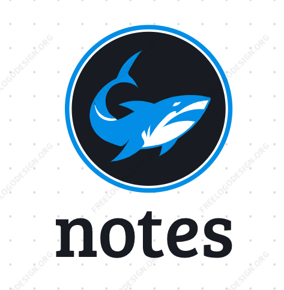
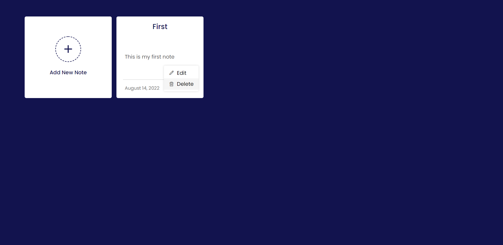

  

<h1 align = "center">Notes App</h1>

Complete Web application

 

This is a simple HTML, CSS, JS based notes writing app which act as the reminders later on. In this note app, users can easily add, edit, or delete their notes. The notes user has added to this app will be stored in the browser's local storage so, they won't remove on page refresh or tab close. This app is going to help the users to keep track of their important notes and help them reminding the importance of this application which helped them through this. 
  
So, on loading the user will be provided the previously stored notes that he/she has already stored for itself. The user is provided the option to add and delete those notes and these options are available at the ellipses right below the content at right of the date. Moving on, if you are new to this app, then you won't have any of the tabs available except for one to <strong>Create a New Note</strong>. You simply have to click on that tab and the screen will popup including a form to add the content. Here the user have to enter the content that he\she wants to save for later use. Once the user pressed the button, the content will be saved in the brwoser's local storage and the popup box will close automatically displaying the new box displayed on the screen. If the user want to change or delete the note, the user simply have to click on the ellipsis (Three dots) and a menu will open. If the user chooses to <strong> delete </strong> a note, the user simply have to click on the Delete Option and a confirm box will appea to confirm the deletion process. If the user chooses to delete the note, the note will be deleted otherwise this process will be aborted. On the other hand, if the user chooses to <strong> edit </strong> a note, the user simply have to open the menu and then click on the Edit Option. The contents will appear in the box. The user simply can change it's content and pess the button to update it. Or click on the x-ixon to abort this process.

### Theme
The theme of this application is quite simple and is a single colored theme. The basic colors that helped building this site's theme are:
- Background Color: &nbsp;&nbsp;&nbsp;&nbsp;&nbsp;&nbsp;                                                                                   `#12134E`
- Text Color:       &nbsp;&nbsp;&nbsp;&nbsp;&nbsp;&nbsp;&nbsp;&nbsp;&nbsp;&nbsp;&nbsp;&nbsp;&nbsp;&nbsp;&nbsp;&nbsp;&nbsp;&nbsp;&nbsp;     `#ccc`
  

## Features
Following are some of the highlights of this project:
- The menu using the ellipsis (Three Dots) has been created for providing edit and delete option
- To input the data, popup form has been created.
- Data is Stored and retreieved from the <strong>Browser's Local Ltorage</strong>.
  

## Resources
Following are some of the resources used in this project:
- [Box Icons](https://boxicons.com/usage#import-css) for making our UI quite interactive.
- [Actionable color Palletter](https://colorpalettes.colorion.co/#26) has helped me choosing the theme for this site.
- [0to255](https://0to255.com/) Website for choosing the hover theme of the button.
  

## Demo
If someone want to check out the live demo of this web application, do checkout on this link given below.
 
[Notes App](https://rebrand.ly/NotesApp_MABCORP)
 
If you like this application and if it's useful for you, then do star this repository

  

## Link To Video
  

## GUI

  

## Technology Stack
Following tecnologies has helped me making this project a fine work:
- HTML
- CSS
- JavaScript
- Local Storage of Browser
  

## Advancement
> No such bug or ammendments reported yet. If you occur something, do inform me.
  

## Deployment Details
The website is deployed using the free hosting provided by **Vercel**

  

  
Later on the link was customized using the well known url shortner and customizer **Rebrandly**:  

  

  

## Developer
Muhammad Abdullah Butt  
abdullahbutt12292210@gmail.com  
> [Instagram](https://www.instagram.com/abdullah.butt.22/) 
> [FaceBook](https://www.facebook.com/profile.php?id=100076291614529) 
> [YouTube](https://www.youtube.com/channel/UCnuOFQyMywg-KuoN-lmav1Q) 
> [Portfolio](https://rebrand.ly/muhammadabdullahPortfolio) 
> [Website](#)
